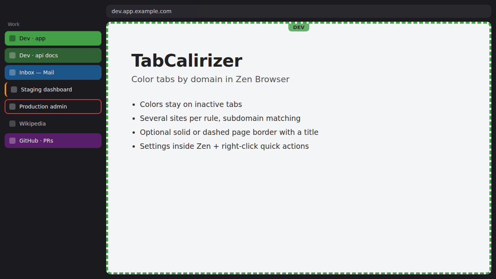

# TabCalirizer

A [Sine](https://github.com/CosmoCreeper/Sine) mod for **Zen Browser** that colors tabs by domain or subdomain, so you can spot your sites at a glance — even on tabs that aren't selected. It can also draw a colored border (solid or dashed) around the page.

## Features

- **Rules by site**: each rule can list several sites (for example, all the hosts of your dev environment), each with its own match type.
  - Exact host: `mail.google.com`
  - Domain + all subdomains: `*.google.com`
  - Base domain only: `google.com` (also matches `www.google.com`)
  - The most specific rule wins: `mail.google.com` beats `*.google.com`.
- **Per-rule styling**
  - Tab background, tab border (left accent or full outline, solid or dashed), or both.
  - Optional page border: 1–20 px, solid or dashed.
  - Optional title per rule, which can be shown as a small tag centered at the top of the page border.
- **Tab colors everywhere**: active, inactive, pinned/essentials, folders and every workspace. Text color switches to black or white automatically for readability.
- **Settings inside Zen**: a *TabCalirizer* section in Zen's settings with a hex color picker, saved color palette, rule list with live preview, and JSON import/export.
- **Tab context menu** (right-click a tab → *TabCalirizer*), for the tab's host or its whole domain (`*.example.com`):
  - *New rule with …*: opens the editor prefilled.
  - *Add … to rule*: appends the site to an existing rule. A site that was in another rule is moved.
  - *Quick color …*: one click with a palette color.
  - *Edit rule*, *Remove site from rule* and *Delete rule*, for the rule that applies to the tab.
- **Toolbar button**: opens the editor for the current site.

## Requirements

- Zen Browser
- Sine (community mod manager)

### Is Sine installed?

Open Zen's settings (`about:preferences`). If the sidebar shows **Sine Mods**, it's installed.

### Installing Sine (Windows)

1. Download the Windows installer from [Sine releases](https://github.com/CosmoCreeper/Sine/releases) (x64 or ARM).
2. Close Zen, run the installer and pick your Zen profile.
3. Reopen Zen. **Sine Mods** now appears in settings.

## Installing TabCalirizer

### From the Sine store (recommended)

1. Zen settings → **Sine Mods** → **Marketplace**.
2. Search for **TabCalirizer** and click **Install**.
3. Restart Zen.

### From GitHub

1. Zen settings → **Sine Mods** → open Sine's settings (gear icon) → enable **"Enable installing JS from unofficial sources"**. JS mods that don't come from the Sine store need this.
2. In the install field, enter `Phoenix-uy/tabcalirizer` and install it.
3. Restart Zen.

Then open settings → **TabCalirizer**, or right-click any tab → **TabCalirizer**.

> Turning the mod off in Sine removes all colors and borders right away. Updates to the mod's JS take effect after a Zen restart.

## Usage

1. Settings → TabCalirizer → **Add rule**.
2. Type a site (`github.com`, `*.google.com`, or paste a URL) and pick its match type. Use **+ Add site** for more sites in the same rule, or paste several hosts/URLs at once. Then pick a color (hex or picker) and the tab style.
3. Optional: tick **Draw a border around the page** and set the thickness and solid/dashed style.
4. **Save rule**. All open tabs update right away.

Use **Test a host** under the rule list to see which rule applies to a given host.

## Data

Rules and palette are stored in `<profile>/tabcalirizer.json`. Use **Import / export** to back them up.

## Customizing intensity

Change these variables at the top of `chrome.css` (or override them in your own `userChrome.css`):

| Variable | Default | Meaning |
|---|---|---|
| `--tcz-inactive-mix` | `55%` | Color strength on inactive tabs |
| `--tcz-hover-mix` | `70%` | On hover |
| `--tcz-selected-mix` | `100%` | On the selected tab |
| `--tcz-accent-width` | `4px` | Left accent bar width |
| `--tcz-outline-width` | `2px` | Outline width |
| `--tcz-label-opacity` | `0.7` | Opacity of the title tag on the page border |

## Development

- `tabcalirizer.uc.js`: browser window script. Paints tabs, draws page borders, adds the context menu and toolbar button.
- `tabcalirizer-prefs.uc.js`: injects the settings section into `about:preferences`.
- `tabcalirizer-store.sys.mjs`: shared storage and the rule-matching engine. All windows share one copy of it.
- `chrome.css` / `settings.css`: styles. Zen-specific selectors are grouped in `SEL` in `tabcalirizer.uc.js` and at the top of `chrome.css`.

Quick dev loop:

1. Edit the installed copy in `<profile>/chrome/sine-mods/tabcalirizer/`.
2. Restart Zen.
3. When it works, copy the changes back to the repo and push.

Debug with the **Browser Console** (`Ctrl+Shift+J`) and filter by `[TabCalirizer]`. Use the **Browser Toolbox** (`Ctrl+Alt+Shift+I`, after enabling *browser chrome and add-on debugging* in DevTools settings) to inspect tab elements.

## Known limitations

- Unloaded (lazy) tabs get their page border once they load. Their tab color applies right away.
- Zen updates can change tab markup. If colors stop showing, check the selectors noted above.
- The toolbar button can be moved or removed via *Customize Toolbar*.
- JS mods run with full browser privileges. Only install mods you trust.

## Support

TabCalirizer is free. If it saves you a few clicks, you can [buy me a coffee](https://buymeacoffee.com/phoenix_uy) ☕. Bug reports and ideas are welcome in [Issues](https://github.com/Phoenix-uy/tabcalirizer/issues).

## License

[MIT](LICENSE) © 2026 Gonzalo Calandria
